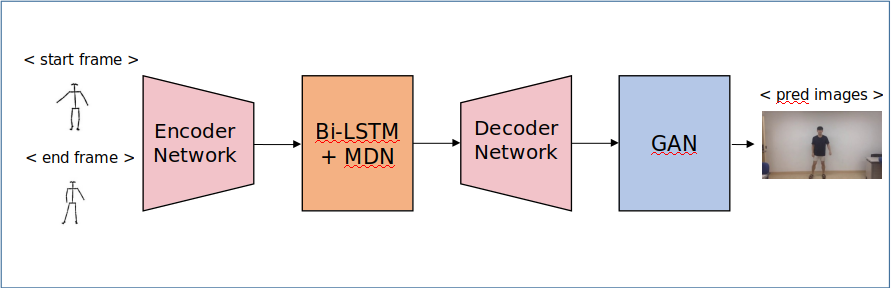
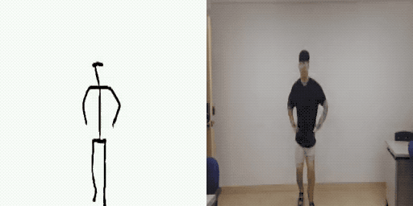
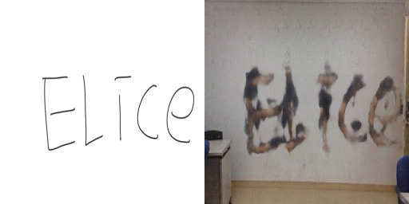
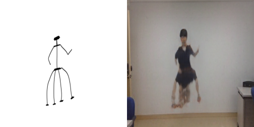

# GAN.D
GAN.D Team repository - 나만의 댄서 만들기

## Team members:

* [강천성](https://github.com/kcs93023)

* 김정효

* 손지명

* 신창엽

* [임진수](https://github.com/Jinsu-L)

* [조혜민](https://github.com/pkh091)

T.A.: 이기훈

## Project Architecture:

  * Overview

  

  * VAE

  * Bi-LSTM + Mixture Density Networks

  * [pix2pix](https://affinelayer.com/pixsrv/)

  * [CMU-openpose](https://github.com/CMU-Perceptual-Computing-Lab/openpose)

## Requirements:

* tensorflow
* opencv-python
* numpy
* scikit-learn

## How to run project:
  1. collect continuous dance images & generate skeleton(CMU openpose)
  2. train VAE - run AE_train.py
  3. create encoded dataset - run generate_encoded_vec.py
  4. train rnn model - run dancegen.py
  5. train pix2pix model - run pix2pix.py

## Project Result:
 
 * [Demo Video](https://www.youtube.com/watch?v=9FTgGdgzsBI&feature=youtu.be) 

 * model result:
 
   

 * other test:
 
   
 
   

## Project Poster

